# HERON Flow Diagrams & Novelty Analysis

This document provides visual Mermaid diagrams for the HERON framework's execution and data flows, alongside justifications for the novelty of each design choice.

---

## 1. High-Level Architecture Overview

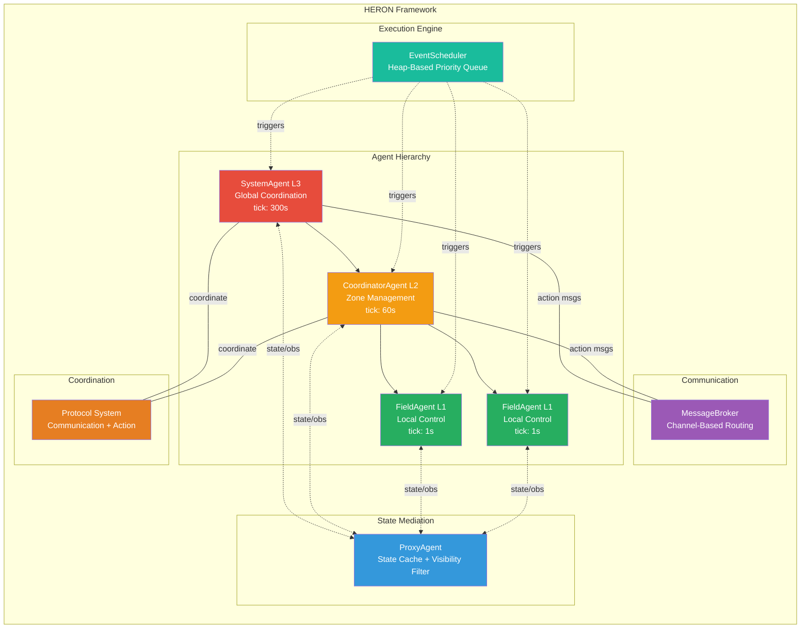

**Novelty:** Unlike PettingZoo (which standardizes the env-algorithm _interface_), HERON standardizes _what happens inside the environment_: how agents access state, communicate, and coordinate. This is a fundamentally different abstraction level.

---

## 2. Dual Execution Modes

### 2.1 CTDE Training Mode (Synchronous)

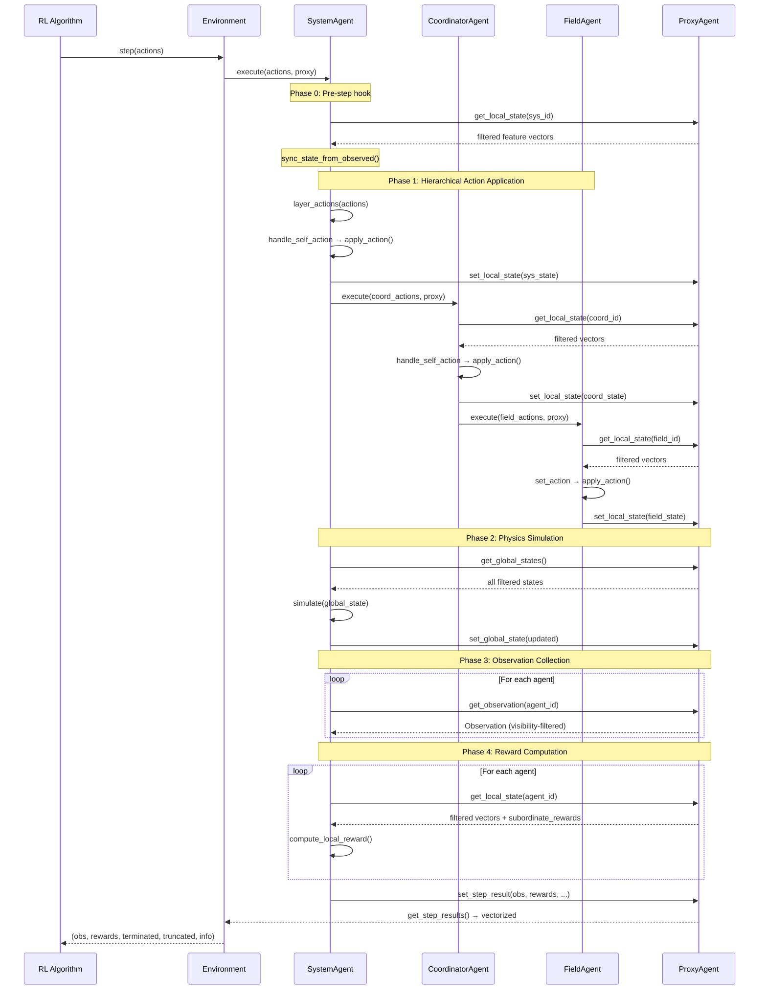

### 2.2 Event-Driven Testing Mode (Asynchronous)

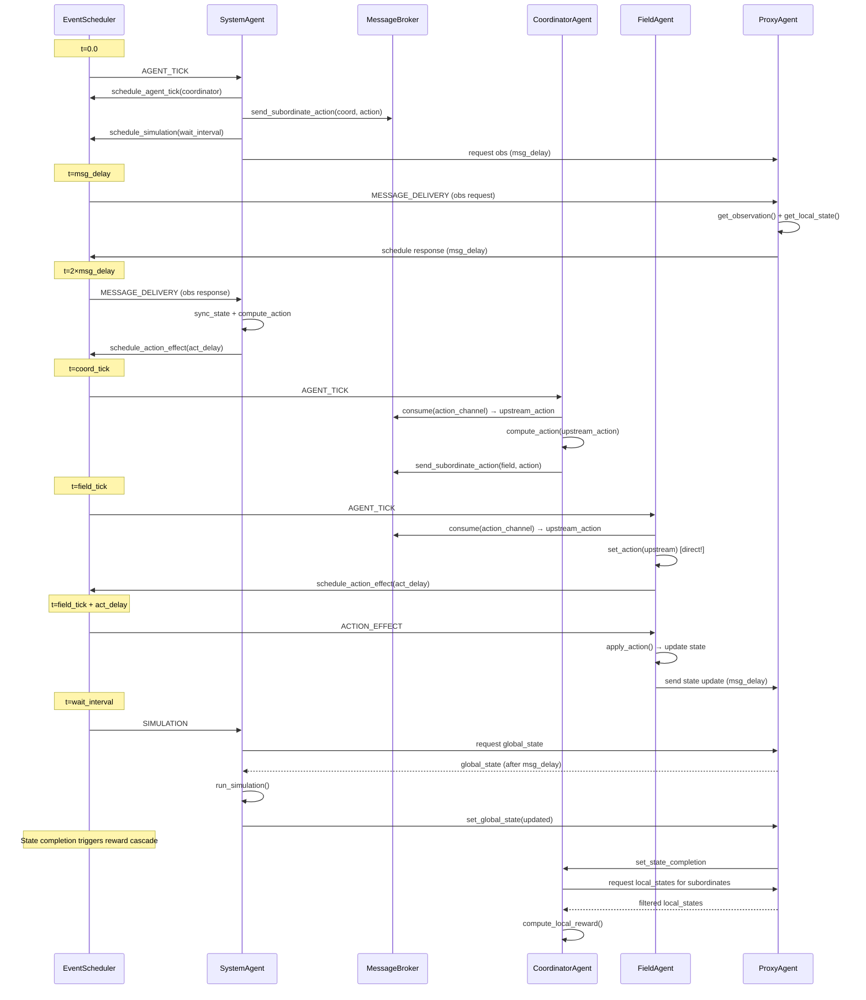

**Novelty:** HERON is the first MARL framework to offer **native dual-mode execution** — synchronous CTDE for training and event-driven for deployment testing — using the same agent hierarchy and protocol system. Existing frameworks (PettingZoo, EPyMARL, MARLlib) only support synchronous `step()`. Event-driven execution cannot be achieved by wrapping; it requires changing the fundamental execution loop.

---

## 3. ProxyAgent: State Mediation Hub

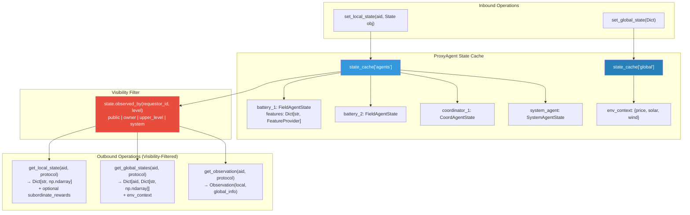

**Novelty:** The ProxyAgent acts as a **single gatekeeper** for all state access, enforcing visibility rules at the feature level. This prevents the common "global state leak" problem in MARL benchmarks where agents inadvertently access information they shouldn't see. No existing framework provides this mediated access pattern.

---

## 4. Feature Visibility System

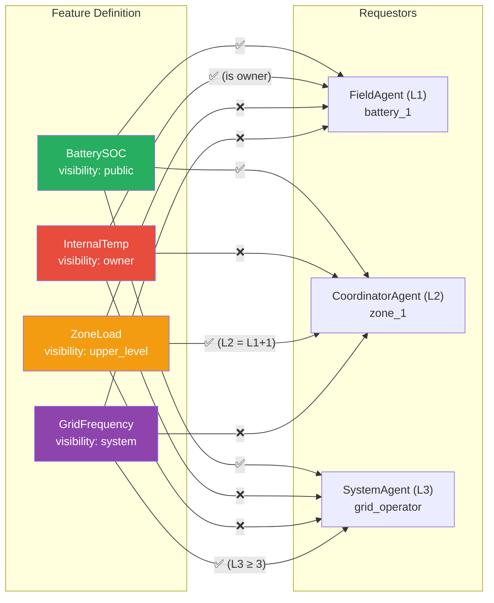

**Novelty:** HERON provides **4-level granular visibility** (public, owner, upper_level, system) as a first-class experimental variable, not a binary on/off switch. Researchers can ablate over visibility configurations to study the impact of information structure on multi-agent learning — something no existing framework supports natively.

---

## 5. Action Passing Flow (Hierarchical Coordination)

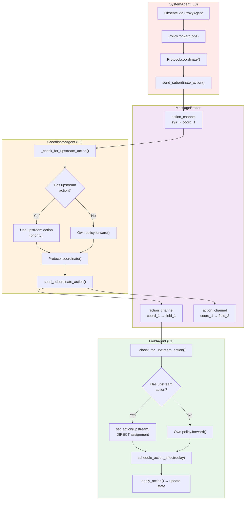

**Key design decisions:**
- **FieldAgent uses direct `set_action()`** — no compute pipeline, just applies the upstream action immediately. This reflects real-world actuators that execute commands without local deliberation.
- **CoordinatorAgent routes through `compute_action()`** — enabling protocol-based decomposition before passing to subordinates.
- **Upstream actions always have priority** over locally computed policies.

---

## 6. Data Type Transformations Across Boundaries

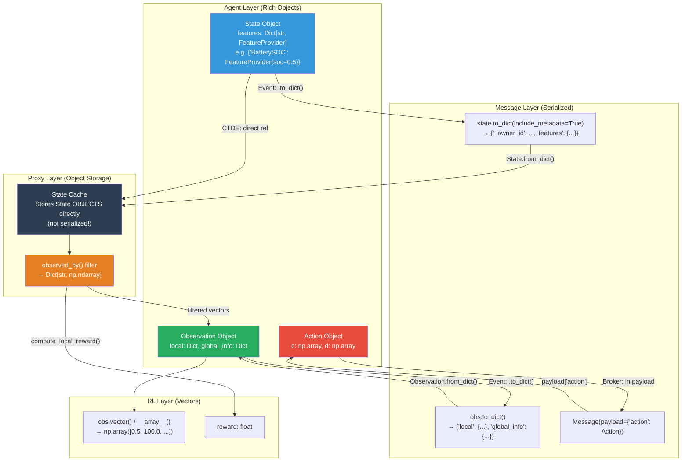

**Key principle:** Serialization only happens at message boundaries. In CTDE mode, State objects pass by reference to the ProxyAgent — zero serialization overhead during training.

---

## 7. Protocol Composition System

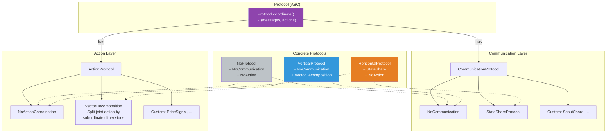

**Novelty:** The two-layer protocol design (Communication + Action) enables composable coordination. Researchers can swap coordination mechanisms without modifying agent code — e.g., compare VerticalProtocol (centralized dispatch) vs. HorizontalProtocol (peer consensus) on the same environment. No existing MARL framework provides this level of protocol composability.

---

## 8. Event Scheduler Architecture

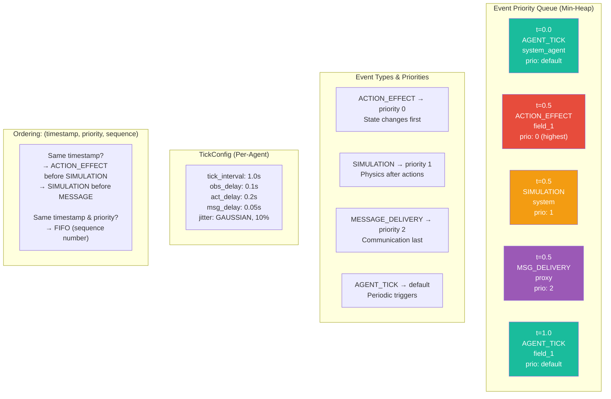

**Novelty:** The EventScheduler enables **agent-paced execution** with configurable per-agent timing, jitter, and realistic communication delays. Timing configurations can be calibrated to real CPS standards (IEEE 2030 for SCADA, NTCIP 1202 for traffic), making HERON the first MARL framework to treat execution timing as an experimental variable.

---

## 9. Complete CTDE Step: End-to-End Data Flow

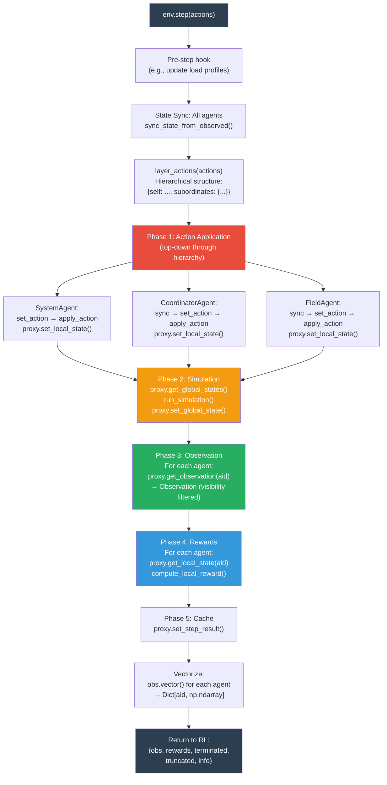

---

## 10. Event-Driven Reward Cascade

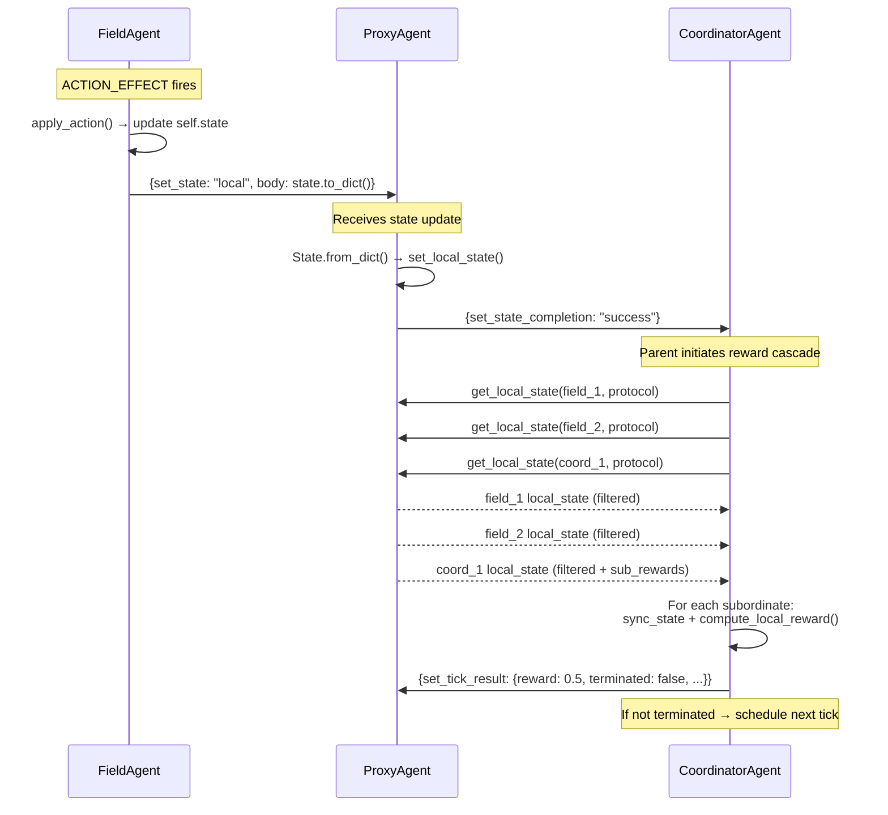

**Novelty:** The parent-initiated reward cascade reflects real CPS patterns where supervisory systems (SCADA, traffic management centers) aggregate status from subordinate devices before making decisions. This naturally produces hierarchical credit assignment.

---

## 11. HERON vs. Existing Frameworks

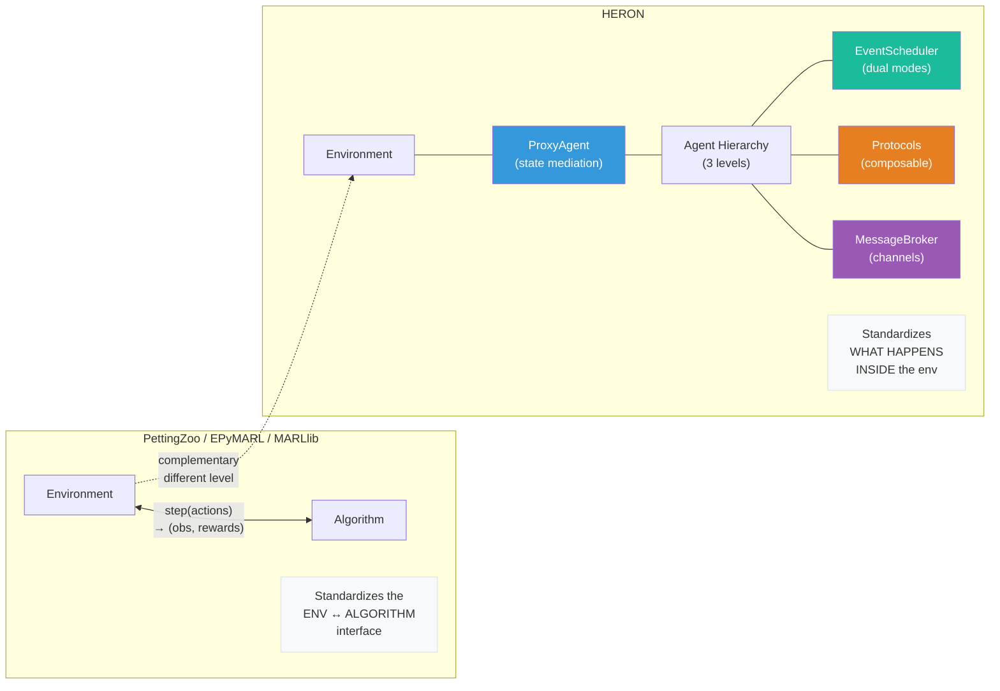

---

## 12. Message Broker Channel Architecture

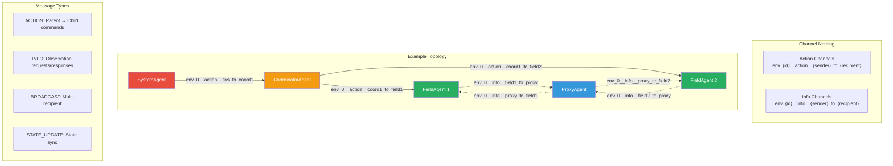

**Novelty:** Environment-isolated channels (`env_{id}__...`) enable parallel training with multiple environment instances without message crosstalk. The typed channel system (action vs. info) enforces communication directionality.

---

## 13. Observation Bundle Design (Event-Driven)

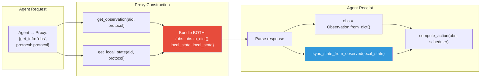

**Design principle:** "When an agent asks for an observation, the proxy gives BOTH observation AND local state." This eliminates a separate state-sync round trip, reducing communication overhead by 50%.

---

## Summary of Novel Contributions

| # | Contribution | What It Enables | Why Existing Frameworks Can't Do It |
|---|-------------|----------------|-------------------------------------|
| 1 | **Dual execution modes** (sync + event-driven) | Train with CTDE, test with realistic CPS timing | Requires fundamentally different execution loop, not achievable by wrapping |
| 2 | **ProxyAgent state mediation** | Prevents global state leak, enforces visibility | No existing framework has a centralized state gatekeeper |
| 3 | **4-level feature visibility** | Ablation over information structures | Existing frameworks offer binary (full/partial) observability |
| 4 | **Composable protocol system** | Swap coordination without changing agents | No framework separates communication from action coordination |
| 5 | **Agent-paced EventScheduler** | CPS-calibrated timing as experimental variable | All existing frameworks assume synchronous stepping |
| 6 | **Hierarchical action passing** | Upstream priority + protocol decomposition | Flat agent models can't express hierarchical control |
| 7 | **Channel-isolated MessageBroker** | Parallel training + typed communication | No framework provides environment-isolated message channels |
