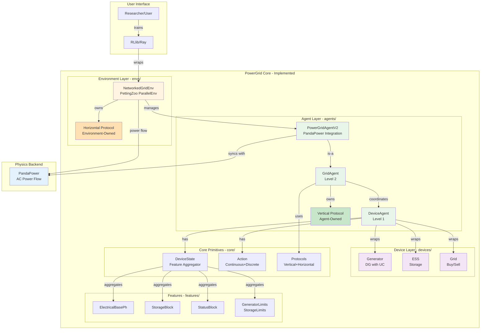
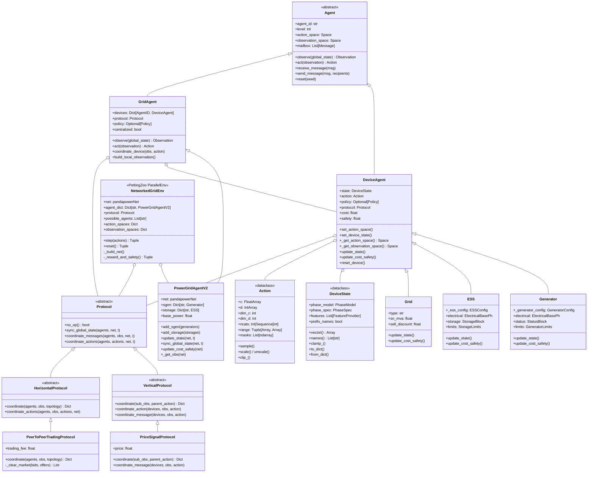
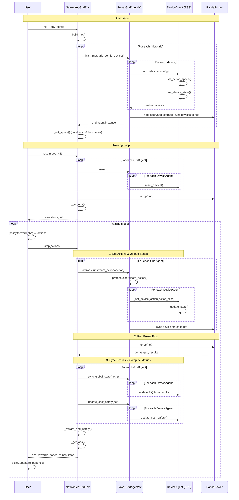
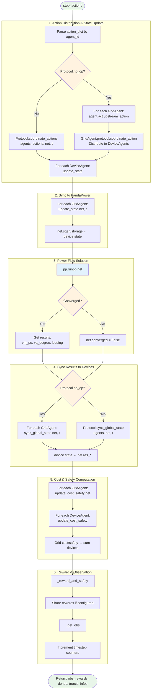
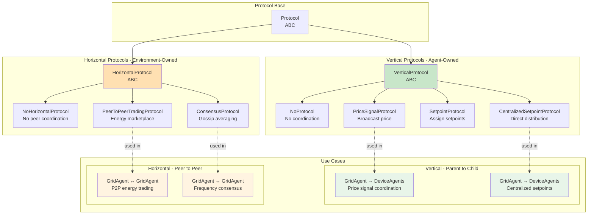
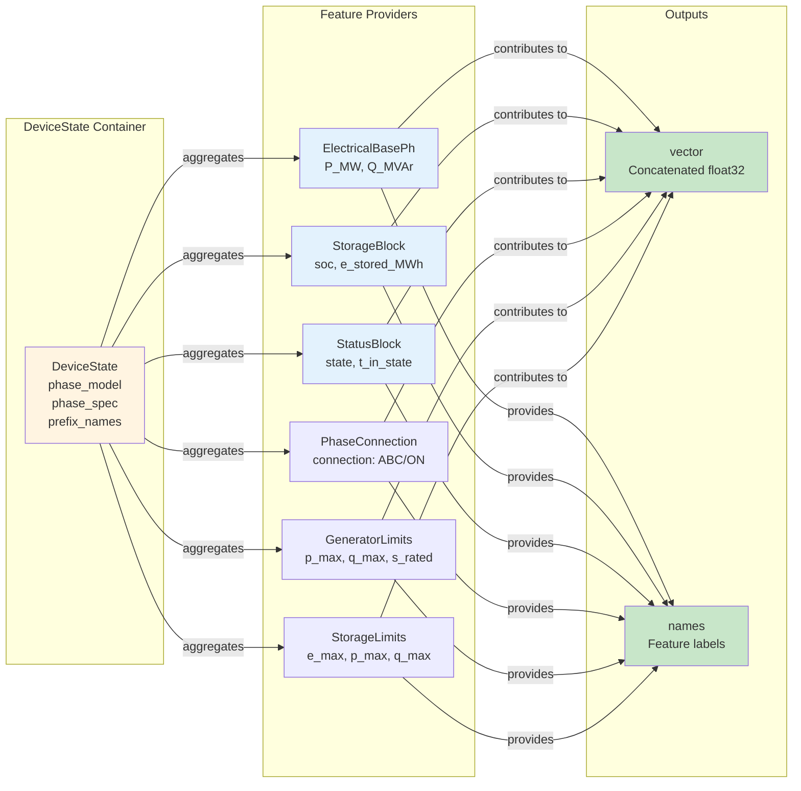
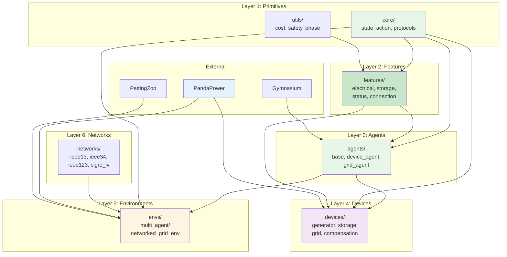

# PowerGrid 2.0: Architecture Diagrams (Implemented)

**Purpose**: Visual guide for the implemented architecture
**Date**: 2025-11-10
**Version**: 2.0 (Reflects actual implementation)
**Status**: ✅ Up-to-date

---

## Diagram Index

1. [Implemented System Architecture](#1-implemented-system-architecture)
2. [Class Hierarchy (Actual)](#2-class-hierarchy-actual)
3. [Agent Lifecycle Sequence](#3-agent-lifecycle-sequence)
4. [Environment Step Flow (Implemented)](#4-environment-step-flow-implemented)
5. [Protocol System Design](#5-protocol-system-design)
6. [Feature-Based State System](#6-feature-based-state-system)
7. [Module Dependencies (Actual)](#7-module-dependencies-actual)

---

## 1. Implemented System Architecture



---

## 2. Class Hierarchy (Actual)



---

## 3. Agent Lifecycle Sequence



---

## 4. Environment Step Flow (Implemented)



---

## 5. Protocol System Design



**Key Design Principle**:
- **Vertical**: Decentralized (each agent manages children)
- **Horizontal**: Centralized (environment provides infrastructure)

---

## 6. Feature-Based State System



**Phase Context Enforcement**:
1. DeviceState validates phase_model + phase_spec
2. Override all child features' phase context
3. Trigger revalidation on each feature
4. Concatenate vectors in feature order

---

## 7. Module Dependencies (Actual)



**Implementation Order**:
1. Core primitives (state, action, protocols)
2. Features (electrical, storage, status)
3. Agents (base, device, grid)
4. Devices (generator, ess, grid)
5. Environments (networked_grid_env)
6. Networks (ieee13, ieee34, etc.)

---

## Quick Reference: Implemented Files

### Core Modules
```
powergrid/
├── core/
│   ├── state.py              # DeviceState, PhaseModel, PhaseSpec
│   ├── action.py             # Action (continuous + discrete)
│   ├── protocols.py          # Vertical + Horizontal protocols
│   └── policies.py           # Policy interface
```

### Agent Layer
```
powergrid/
├── agents/
│   ├── base.py               # Agent ABC, Observation, Message
│   ├── device_agent.py       # DeviceAgent wrapper
│   └── grid_agent.py         # GridAgent, PowerGridAgentV2
```

### Device Layer
```
powergrid/
├── devices/
│   ├── generator.py          # Generator (DG with UC)
│   ├── storage.py            # ESS
│   ├── grid.py               # Grid connection
│   └── compensation.py       # Shunt, SVC (WIP)
```

### Features
```
powergrid/
├── features/
│   ├── base.py               # FeatureProvider protocol
│   ├── electrical.py         # ElectricalBasePh
│   ├── storage.py            # StorageBlock
│   ├── status.py             # StatusBlock
│   ├── connection.py         # PhaseConnection
│   ├── generator_limits.py   # GeneratorLimits
│   └── ...                   # More features
```

### Environment
```
powergrid/
├── envs/
│   └── multi_agent/
│       ├── networked_grid_env.py     # NetworkedGridEnv (PettingZoo)
│       └── multi_agent_microgrids.py # Example environments
```

---

## Usage Patterns

### Pattern 1: Create Device with Features
```python
from powergrid.agents.generator import Generator

gen = Generator(
    agent_id="dg1",
    device_config={
        "device_state_config": {
            "phase_model": "balanced_1ph",
            "p_max_MW": 5.0,
            "q_max_MVAr": 3.0,
            "cost_curve_coefs": [0.01, 1.0, 0.0]
        }
    }
)

# gen.state contains:
# - ElectricalBasePh (P, Q)
# - StatusBlock (UC state)
# - PhaseConnection (bus connection)
# - GeneratorLimits (capability)
```

### Pattern 2: Coordinate with Vertical Protocol
```python
from powergrid.agents.grid_agent import GridAgent
from powergrid.core.protocols import PriceSignalProtocol

grid = GridAgent(
    agent_id="mg1",
    devices=[ess, gen, solar],
    protocol=PriceSignalProtocol(initial_price=50.0)
)

# Protocol broadcasts price to all devices
obs = grid.observe(global_state)
action = grid.act(obs, upstream_action=parent_action)
# → protocol.coordinate_message() sends price to devices
```

### Pattern 3: Multi-Agent Environment
```python
from powergrid.envs.multi_agent.networked_grid_env import NetworkedGridEnv
from powergrid.core.protocols import PeerToPeerTradingProtocol

env = NetworkedGridEnv(env_config={
    "max_episode_steps": 24,
    "protocol": PeerToPeerTradingProtocol(trading_fee=0.01)
})

# Environment coordinates GridAgents via P2P protocol
obs, info = env.reset()
actions = {agent_id: policy(obs[agent_id]) for agent_id in env.agents}
obs, rewards, dones, truncs, infos = env.step(actions)
```

---

## Conclusion

PowerGrid 2.0 implements a **clean, modular architecture** with:
- ✅ Hierarchical agent system (2 levels)
- ✅ Dual protocol system (vertical + horizontal)
- ✅ Feature-based device state
- ✅ PettingZoo-compatible environment
- ✅ PandaPower integration

**Design Philosophy**: Separation of concerns between agent logic, device physics, coordination protocols, and environment simulation.

---

**Document Maintainer**: PowerGrid Development Team
**Last Updated**: 2025-11-10
**Next Update**: After SystemAgent implementation
