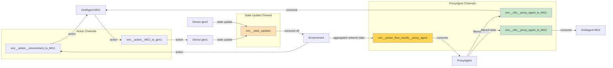

# PowerGrid 2.0: Distributed Architecture

**Purpose**: Document the distributed execution mode with message-based communication
**Date**: 2025-11-20
**Status**: ✅ Implemented

---

## Overview

PowerGrid 2.0 supports two execution modes:

1. **Centralized Mode** (centralized=True): Traditional multi-agent RL with full observability
2. **Distributed Mode** (centralized=False): Realistic distributed control with message-based communication

---

## 1. Execution Mode Comparison


**Key Principle**: In distributed mode, agents **never access net directly**. All information flows through messages.

**ProxyAgent Role**: The ProxyAgent acts as an intermediary that receives aggregated network state from the environment and distributes filtered, agent-specific information to individual GridAgents. This enforces information hiding and allows for visibility control.

> **Note**: The base `ProxyAgent` is defined in `heron.agents.proxy_agent` and is domain-agnostic. The power grid version (`powergrid.agents.proxy_agent.ProxyAgent`) extends it with the `power_flow` channel type.

---

## 2. Distributed Step Flow


---

## 3. Message Channels



**Channel Naming Convention**:
- Actions: `env_{env_id}__action__{sender}_to_{recipient}`
- State Updates: `env_{env_id}__state_updates`
- ProxyAgent Aggregation: `env_{env_id}__power_flow_results__proxy_agent`
- ProxyAgent Distribution: `env_{env_id}__info__proxy_agent_to_{agent_id}`

---

## 4. State Update Flow


**Key Points**:
1. Devices maintain local state (P, Q, SOC, status)
2. Devices publish only necessary updates to environment
3. Environment is responsible for syncing to pandapower network
4. Devices never see or touch the network object

---

## 5. Network State Distribution via ProxyAgent


**ProxyAgent Responsibilities**:
1. **Receive**: Consume aggregated network state from environment
2. **Cache**: Store the most recent network state for all agents
3. **Filter**: Apply visibility rules to determine what each agent can see
4. **Distribute**: Send agent-specific filtered state to each GridAgent

**Benefits of ProxyAgent**:
- **Information Hiding**: Agents only see their own network segment
- **Scalability**: Single aggregated message from environment, filtered distribution
- **Flexibility**: Visibility rules can be customized per agent
- **Realism**: Mimics real-world information asymmetry in power systems

---

## 6. ProxyAgent Implementation Details

### 6.1 Aggregated State Structure

The environment sends a single aggregated message to ProxyAgent containing state for all agents:
```python
# Aggregated state sent to ProxyAgent
{
    'converged': bool,
    'agents': {
        'MG1': {
            'converged': bool,
            'device_results': {
                'gen1': {'p_mw': float, 'q_mvar': float},
                'ess1': {'p_mw': float, 'q_mvar': float}
            },
            'bus_voltages': {
                'vm_pu': [float, ...],
                'overvoltage': float,
                'undervoltage': float
            },
            'line_loading': {
                'loading_percent': [float, ...],
                'overloading': float
            }
        },
        'MG2': { ... },
        'MG3': { ... }
    }
}
```

### 6.2 Filtered State Structure

ProxyAgent extracts and filters each agent's specific state:
```python
# Filtered state sent to MG1
{
    'converged': bool,
    'device_results': {
        'gen1': {'p_mw': float, 'q_mvar': float},
        'ess1': {'p_mw': float, 'q_mvar': float}
    },
    'bus_voltages': {
        'vm_pu': [float, ...],      # Only MG1's buses
        'overvoltage': float,
        'undervoltage': float
    },
    'line_loading': {
        'loading_percent': [float, ...],  # Only MG1's lines
        'overloading': float
    }
}
```

### 6.3 Key Methods

**`receive_network_state_from_environment()`**:
- Consumes aggregated state from environment channel
- Caches state for distribution
- Returns: Network state payload or None

**`distribute_network_state_to_agents()`**:
- Iterates through subordinate agents
- Extracts agent-specific state from cache
- Applies visibility filtering
- Publishes to agent's info channel

**`_filter_state_for_agent(agent_id, state)`**:
- Applies visibility rules (e.g., "owner", "public")
- Removes information agent shouldn't see
- Returns: Filtered state dict

### 6.4 Usage in Environment

```python
# In NetworkedGridEnv.step() - distributed mode
self._publish_network_state_to_agents()

# Implementation
def _publish_network_state_to_agents(self):
    # 1. Collect aggregated state
    aggregated_state = {'converged': self.net.converged, 'agents': {}}
    for agent in self.agent_dict.values():
        aggregated_state['agents'][agent.agent_id] = extract_agent_state(agent)

    # 2. Publish to ProxyAgent
    self.proxy_agent.receive_network_state_from_environment()

    # 3. ProxyAgent distributes filtered state
    self.proxy_agent.distribute_network_state_to_agents()
```

---

## 6. Implementation: Key Methods

### Environment Side

```python
# powergrid/envs/multi_agent/networked_grid_env.py

def _consume_all_state_updates(self) -> List[Dict[str, Any]]:
    """Consume all device state updates from message broker."""
    channel = ChannelManager.state_update_channel(self._env_id)
    messages = self.message_broker.consume(
        channel, recipient_id="environment",
        env_id=self._env_id, clear=True
    )
    return [msg.payload for msg in messages]

def _apply_state_updates_to_net(self, updates: List[Dict[str, Any]]) -> None:
    """Apply device states to pandapower network."""
    for update in updates:
        agent_id = update.get('agent_id')
        device_type = update.get('device_type')
        # Find owner, construct name, update net
        element_name = f"{grid_agent.name} {agent_id}"
        element_idx = pp.get_element_index(self.net, device_type, element_name)
        self.net[device_type].loc[element_idx, 'p_mw'] = update.get('P_MW', 0.0)
        # ...

def _publish_network_state_to_agents(self):
    """Publish power flow results to agents via messages."""
    for agent in self.agent_dict.values():
        network_state = self._extract_network_state_for_agent(agent)
        channel = ChannelManager.power_flow_result_channel(
            self._env_id, agent.agent_id
        )
        message = Message(
            env_id=self._env_id,
            sender_id="environment",
            recipient_id=agent.agent_id,
            timestamp=self._t,
            message_type=MessageType.INFO,
            payload=network_state
        )
        self.message_broker.publish(channel, message)
```

### Agent Side

```python
# powergrid/agents/grid_agent.py

def _consume_network_state(self) -> Optional[Dict[str, Any]]:
    """Consume network state from environment via message broker."""
    channel = ChannelManager.power_flow_result_channel(
        self.env_id, self.agent_id
    )
    messages = self.message_broker.consume(
        channel, recipient_id=self.agent_id,
        env_id=self.env_id, clear=True
    )
    if messages:
        return messages[-1].payload
    return None

def update_cost_safety(self, net):
    """Update cost and safety metrics.

    - Centralized (net != None): Access net directly
    - Distributed (net == None): Use messages
    """
    # Device costs (always local)
    for dg in self.sgen.values():
        dg.update_cost_safety()
        self.cost += dg.cost

    # Network metrics
    if net is not None:
        # Centralized: access net directly
        local_bus_ids = pp.get_element_index(net, 'bus', self.name, False)
        local_vm = net.res_bus.loc[local_bus_ids].vm_pu.values
        # ...
    else:
        # Distributed: consume from messages
        network_state = self._consume_network_state()
        if network_state and network_state.get('converged'):
            overvoltage = network_state['bus_voltages']['overvoltage']
            undervoltage = network_state['bus_voltages']['undervoltage']
            # ...
```

### Device Side

```python
# powergrid/devices/generator.py

def _publish_state_updates(self) -> None:
    """Publish electrical state to environment."""
    if not self.message_broker:
        return

    channel = ChannelManager.state_update_channel(self.env_id)
    message = Message(
        env_id=self.env_id,
        sender_id=self.agent_id,
        recipient_id="environment",
        timestamp=self._timestep,
        message_type=MessageType.STATE_UPDATE,
        payload={
            'agent_id': self.agent_id,
            'device_type': 'sgen',
            'P_MW': float(self.electrical.P_MW),
            'Q_MVAr': float(self.electrical.Q_MVAr or 0.0),
            'in_service': bool(self.status.in_service),
        }
    )
    self.message_broker.publish(channel, message)
```

---

## 7. Configuration

### Centralized Mode

```yaml
# powergrid/envs/configs/example.yml
centralized: true  # or omit (default is false now)
# No message broker created
# Agents access net directly
```

### Distributed Mode

```yaml
# powergrid/envs/configs/example.yml
centralized: false
message_broker: 'in_memory'  # InMemoryBroker (default)
# Message broker automatically created
# Agents communicate via messages only
```

---

## 8. Benefits of Distributed Mode

### Realism
- Mimics real-world distributed control systems
- Agents have limited observability (only their local network)
- Communication delays can be simulated
- Suitable for hierarchical/decentralized control research

### Modularity
- Clear separation between agent logic and physics simulation
- Agents are independent, can run in separate processes
- Easy to extend to actual distributed deployments (Kafka, RabbitMQ)

### Testing
- Validate distributed algorithms before deployment
- Test communication protocols
- Simulate network failures, delays

---

## 9. Future Extensions

### Possible Enhancements
1. **Communication Delays**: Add latency to message delivery
2. **Message Dropping**: Simulate unreliable networks
3. **Bandwidth Limits**: Constrain message sizes/frequency
4. **External Brokers**: Kafka, RabbitMQ integration for true distributed training
5. **Asynchronous Execution**: Allow agents to step at different rates

---

## Conclusion

The distributed architecture in PowerGrid 2.0 provides:
- ✅ Realistic distributed control with message-based communication
- ✅ Clear separation between environment (has net access) and agents (message-only)
- ✅ Extensible message broker system (InMemoryBroker → Kafka)
- ✅ Backward compatible (centralized mode still works)
- ✅ Foundation for future distributed RL research

**Design Principle**: Agents should never access global state directly. All information flows through well-defined message channels.

---

**Document Maintainer**: PowerGrid Development Team
**Last Updated**: 2025-11-20
**Related Docs**: architecture_diagrams.md, kafka_agent_implementation_plan.md
