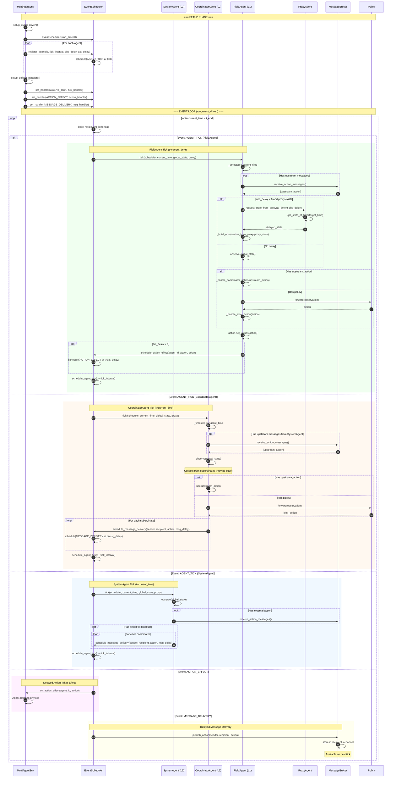
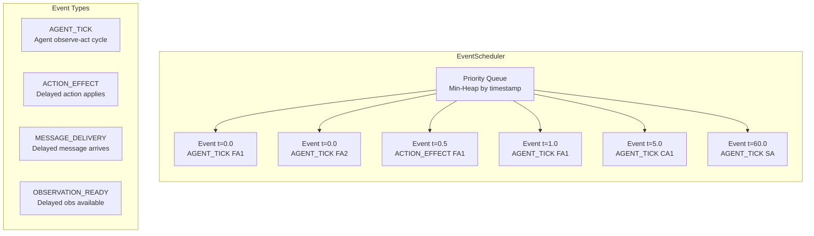
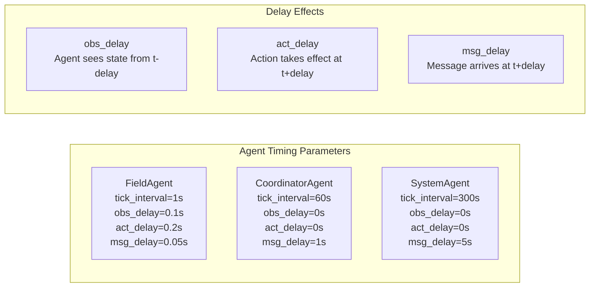
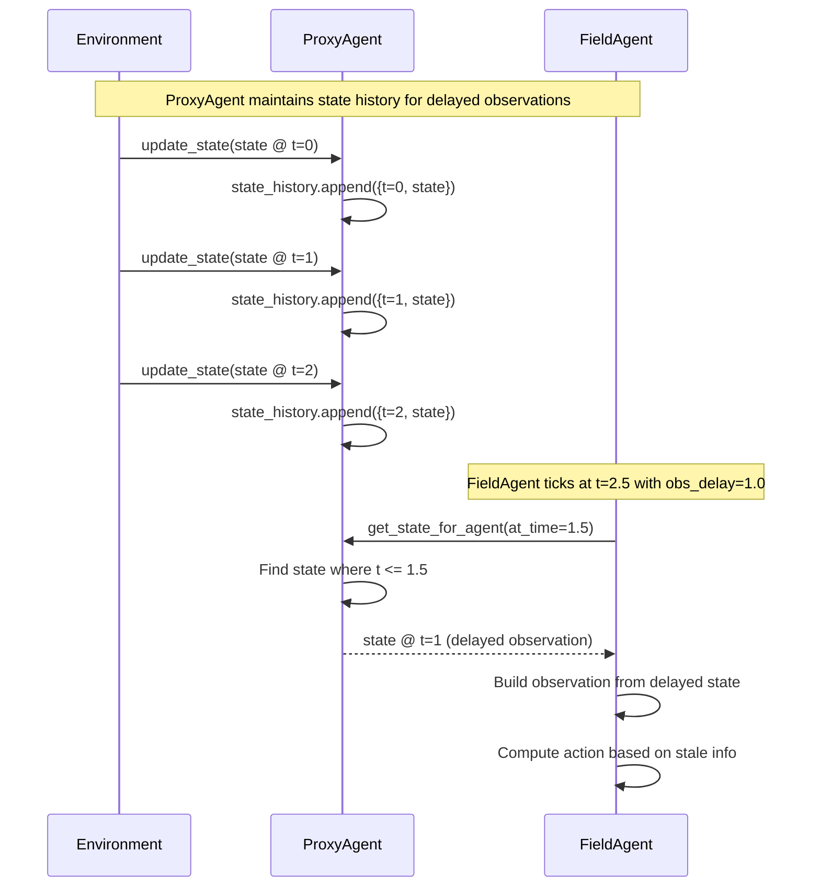
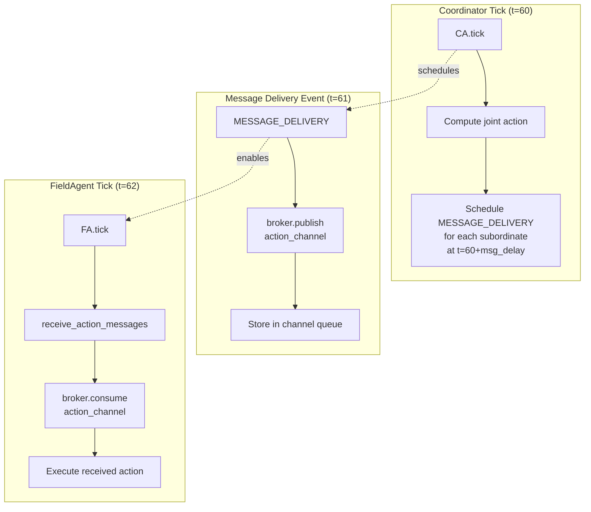
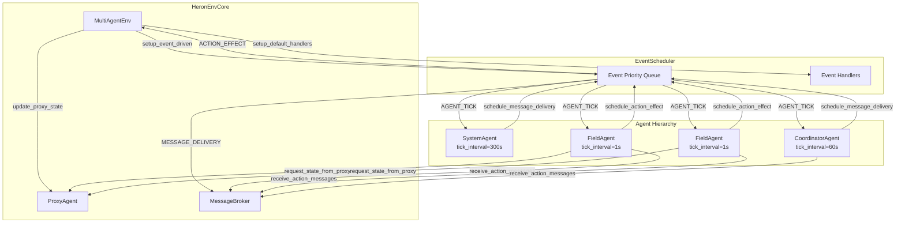

# HERON Testing Flow (Option B - Event-Driven)

This diagram shows the event-driven execution flow used during testing, where agents operate asynchronously with realistic timing delays.

## Event Priority Queue

## Timing Parameters

## ProxyAgent State History

## Message Broker Flow in Event-Driven Mode

## Complete Event-Driven Architecture

