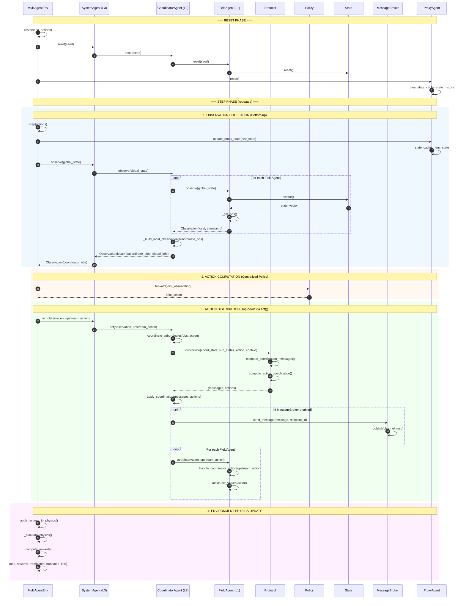

# HERON Training Flow (Option A - Synchronous)

This diagram shows the synchronous execution flow used during training with Centralized Training, Decentralized Execution (CTDE).



## Key Components

### Agent Hierarchy (L1 → L2 → L3)


### Data Structures


### Message Broker Channels

```mermaid
graph LR
    subgraph "Channel Naming Convention"
        AC[action channel<br/>env_{id}__action__{upstream}_to_{node}]
        IC[info channel<br/>env_{id}__info__{node}_to_{upstream}]
        BC[broadcast channel<br/>env_{id}__broadcast__{agent}]
        SC[state_update channel<br/>env_{id}__state_updates]
    end

    subgraph "Flow Direction"
        Parent -->|ACTION| Child
        Child -->|INFO| Parent
        Any -->|BROADCAST| All
        Env -->|STATE_UPDATE| Agents
    end
```
