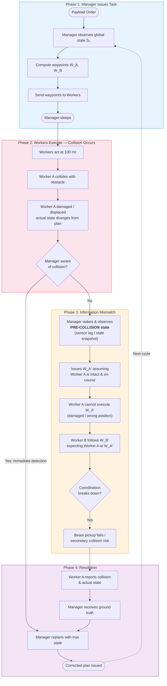
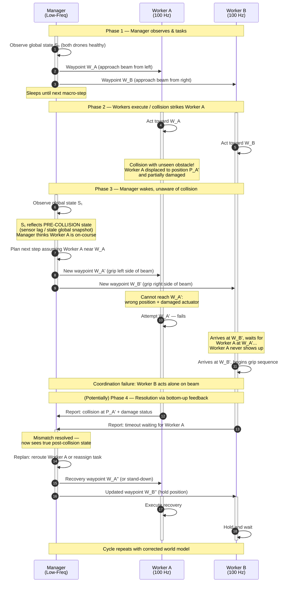
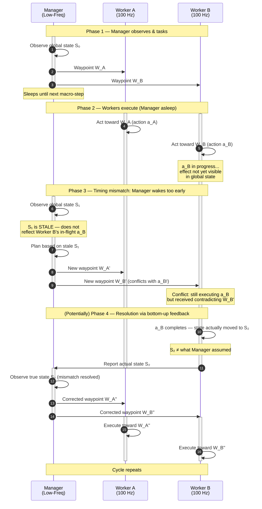
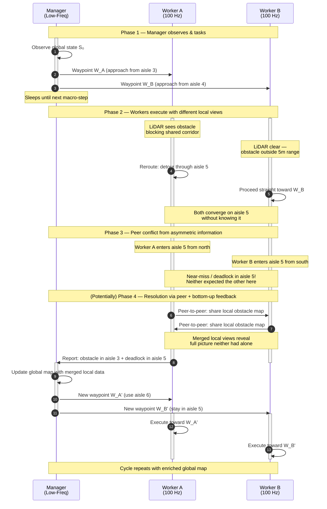
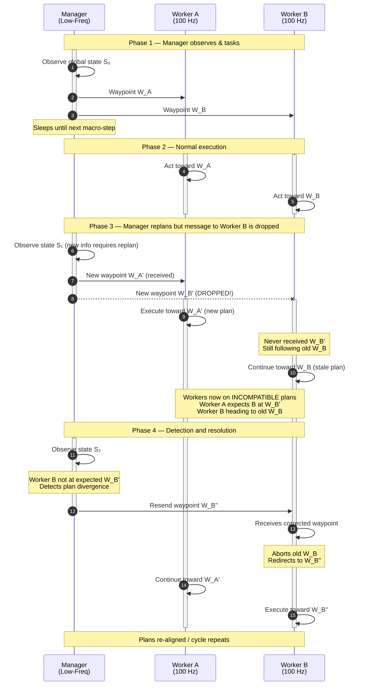
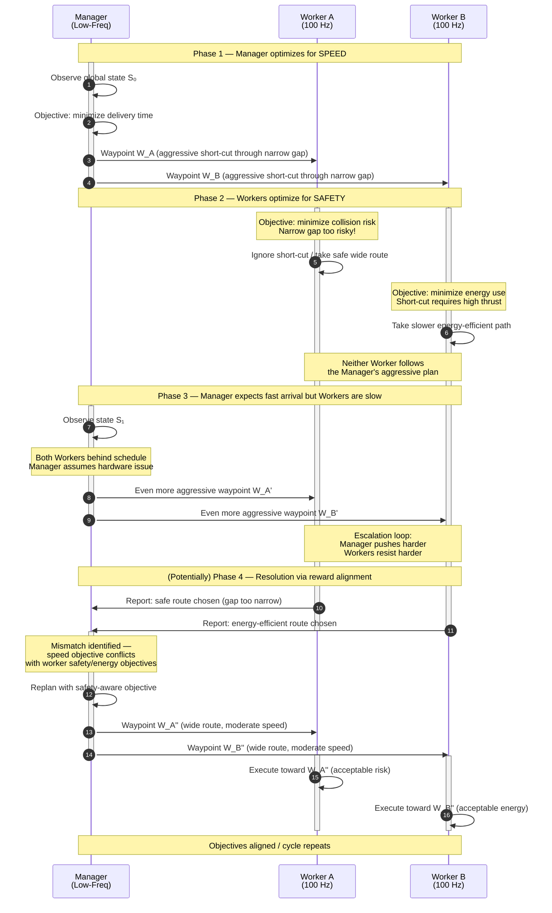

# HMARL-CBF Event-Driven Execution Diagrams

Scenario: Two drones (Worker A, Worker B) cooperatively lift a beam in a warehouse, coordinated by a Manager. Under the HMARL-CBF setup, five distinct types of information mismatch can arise. Each is illustrated below.

---

## 1. Collision-Induced Mismatch

An accident disrupts Worker A's state, but the Manager's next observation still reflects the pre-collision world, leading to instructions that assume a reality that no longer exists.

### Flow Diagram

### Sequence Diagram

---

## 2. Timing-Induced Mismatch

The Manager observes and decides at a slower cadence than the Workers act. Worker B's action is still in-flight when the Manager reads state, so it plans on a snapshot that is already outdated.

### Sequence Diagram

---

## 3. Partial Observability Mismatch

Each Worker only sees a local slice of the world via LiDAR (5m radius). Worker A detects an obstacle that Worker B cannot see. They make conflicting local decisions based on different views of the same environment.

### Sequence Diagram

---

## 4. Communication Failure Mismatch

A waypoint message from the Manager to Worker B is dropped. Worker B continues executing stale instructions while Worker A and the Manager have moved on to a new plan.

### Sequence Diagram

---

## 5. Goal Conflict / Reward Mismatch

The Manager optimizes for task speed (deliver beam ASAP). The Workers optimize for flight safety (minimize energy and collision risk). Their objectives diverge, producing actions that are locally rational but globally incompatible.

### Sequence Diagram

